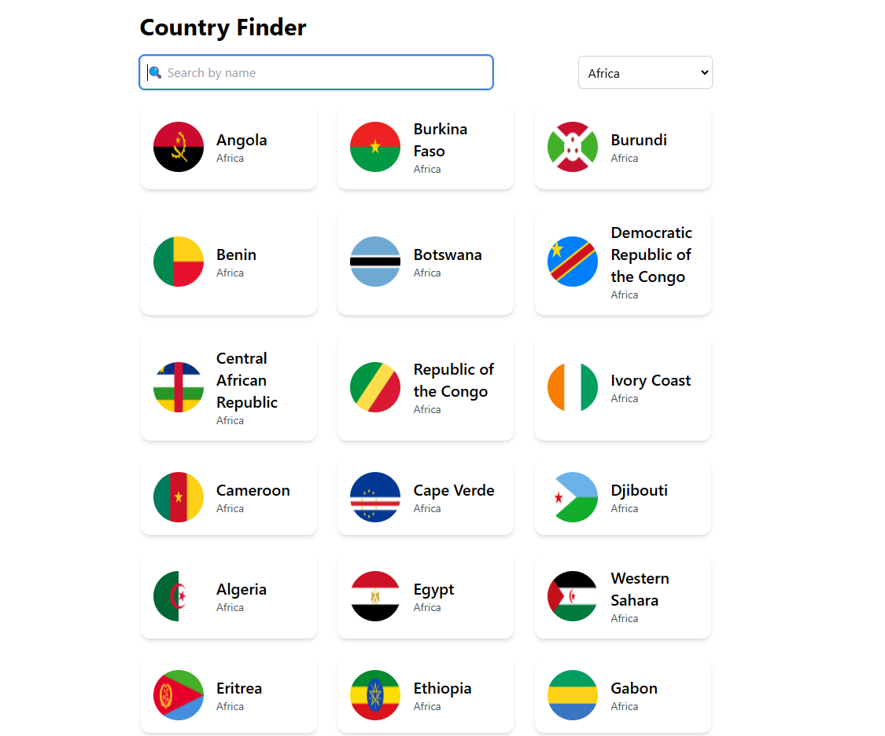

# TypeScript, Tailwind CSS, GraphQL

HTML, CSS, JavaScript, TypeScript, Tailwind CSS

## Stack

- _TypeScript_
- _React.js_
- _Tailwind CSS_ for styling
- _Jest/React-testing-library_ for tests

## Searchcountry

## Functionality

App will load and display data for countries from [this public Countries GraphQL API](https://countries.trevorblades.com).

- User can search for a country
- User can filter countries by continents
- User can click on a country to see more information of the selected country.
- User can "go back" after selecting a specific country.

